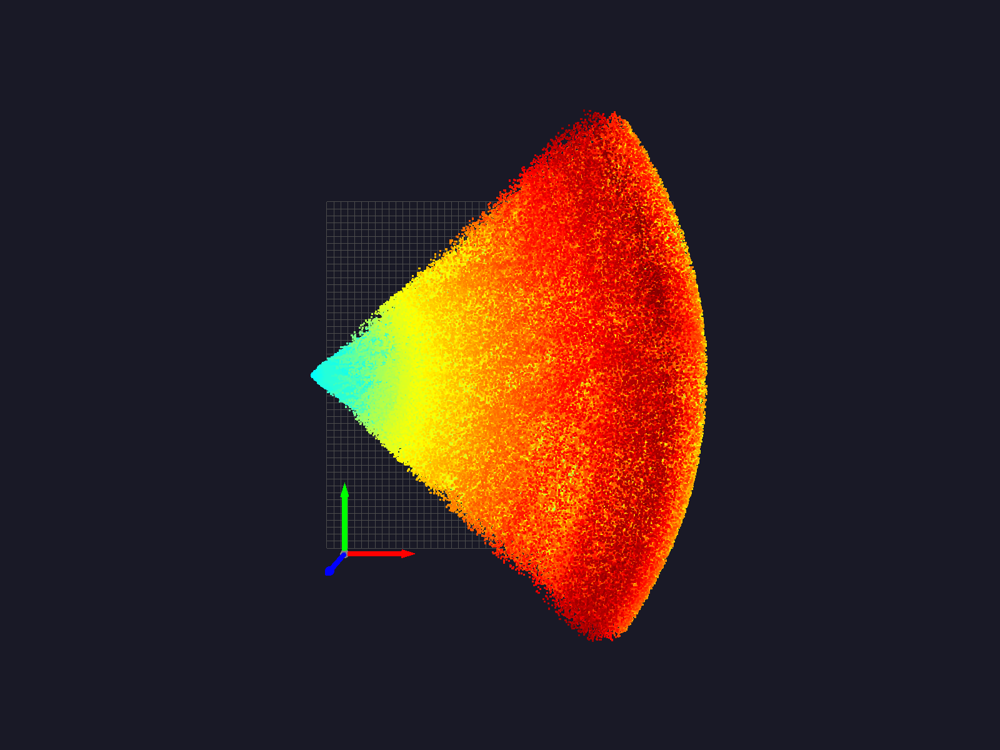
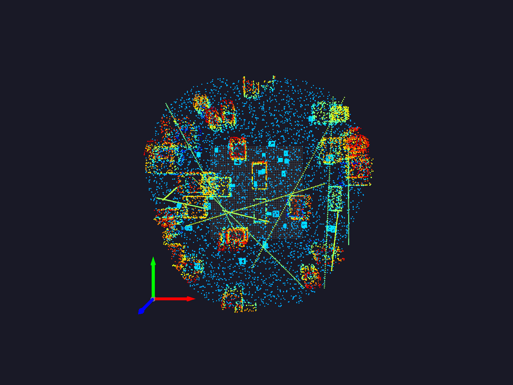

# Livox Motion Compensation Simulator

[](https://www.python.org/)
[](LICENSE)
[](https://github.com/manishborikar92/livox-motion-compensation-sim/actions)

> 🛰️ **Simulate, Align, and Export LiDAR Data** — A complete motion compensation toolkit for the Livox Mid-70 with realistic environments, GPS/IMU noise modeling, and multi-format outputs.

A high-fidelity **LiDAR motion compensation simulator** designed for the **Livox Mid-70**.
Generates realistic trajectories, 3D environments, LiDAR scans, and applies **motion correction** for globally aligned point clouds.
Exports data in **PCD**, **LAS**, and native **LVX** formats for compatibility with Livox Viewer.

---

## ✨ Features

* **Simulated Trajectories** – Linear, circular, and figure-eight motion.
* **Environment Generation** – Simple, medium, and complex urban-like scenes.
* **Sensor Noise Simulation** – GPS, IMU, and LiDAR range noise.
* **Motion Compensation** – Aligns frames using GPS/IMU data.
* **Multi-Format Export** – PCD, LAS, and Livox LVX (v1, v2, v3).
* **Visualization Tools** – 2D/3D trajectory plots, before/after point cloud comparison.
* **Reports** – Auto-generated statistics and file summaries.

---

## 📦 Installation

```bash
# Clone the repository
git clone https://github.com/manishborikar92/livox-motion-compensation-sim.git
cd livox-motion-compensation-sim

# Create virtual environment
python -m venv venv
source venv/bin/activate  # On Windows: venv\Scripts\activate

# Install dependencies
pip install -r requirements.txt
```

---

## 🚀 Usage

### Run Simulation

```bash
python lidar_motion_compensation.py
```

Edit the configuration in the `main()` function to choose:

* **`urban_complex`**
* **`highway_simple`**
* **`parking_detailed`**

Example:

```python
config_name = 'urban_complex'
```

---

## 📂 Output Structure

After running, the results will be saved in `lidar_simulation_output/`:

```
lidar_simulation_output/
├── motion_data.csv
├── trajectory.csv
├── raw_scans_pcd/             # Raw overlapped LiDAR frames
├── aligned_scans_pcd/         # Motion-compensated frames
├── merged_aligned.pcd
├── merged_raw_overlapped.pcd
├── merged_aligned.las
├── lidar_data.lvx
├── lidar_data.lvx2
├── lidar_data.lvx3
├── simulation_overview.png
├── 3d_trajectory.png
└── pointcloud_comparison.png
```

---

## 🖼️ Visual Examples

| Before (Overlapped)  | After (Motion Compensation)  |
| -------------------- | ---------------------------- |
|  |  |

---

## 🛠️ Configuration Options

All parameters can be adjusted via the `LiDARMotionSimulator` config dictionary:

```python
{
    "duration": 60.0,
    "lidar_fps": 10,
    "trajectory_type": "figure_eight",
    "environment_complexity": "complex",
    "max_speed": 15.0
}
```

---

## 📜 License

This project is licensed under the [MIT License](LICENSE).

---

## 👌 Contributing

1. Fork the repo
2. Create your feature branch (`git checkout -b feature/yourfeature`)
3. Commit changes (`git commit -m 'Add feature'`)
4. Push to branch (`git push origin feature/yourfeature`)
5. Open a Pull Request

---

## 📧 Contact

**Manish Borikar** – [manishborikar@proton.me](mailto:manishborikar@proton.me)
GitHub: [@manishborikar92](https://github.com/manishborikar92)
**Prankita Potbhare** – [prankitapotbhare@proton.me](mailto:prankitapotbhare@proton.me)
GitHub: [@prankitapotbhare](https://github.com/prankitapotbhare)